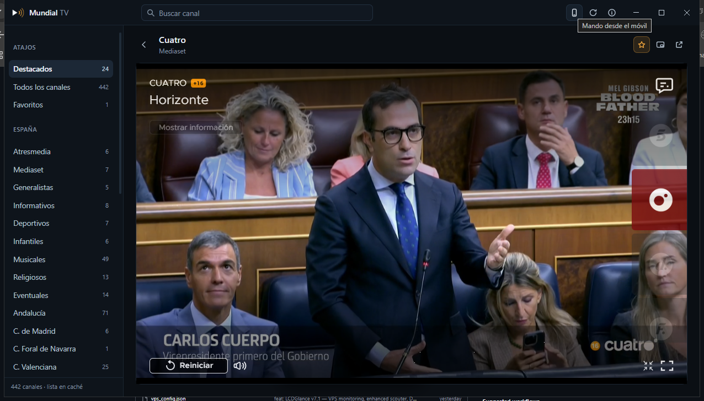
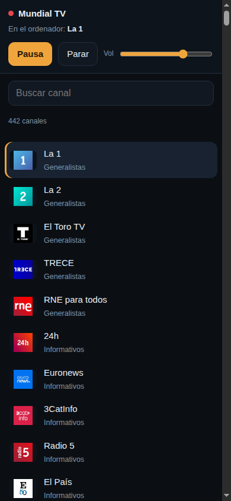

# Mundial TV

Aplicación de escritorio para ver televisión en directo de todo el mundo desde el ordenador. La TDT española al completo, las autonómicas, los canales internacionales y los que solo emiten desde su propio reproductor, todo en una sola ventana y sin páginas web de por medio.



---

## Qué hace

- **Rejilla de canales** con los logotipos reales, ordenada por país y por género: España (generalistas, informativos, deportivos, infantiles y las diecisiete comunidades) y el resto del mundo por continente.
- **Reproductor propio** para los canales que emiten en HLS público: calidad seleccionable, pista de audio (castellano, original, audiodescripción) y subtítulos.
- **Conmutación automática de fuente.** Casi todos los canales publican varias direcciones; si la primera falla, se prueban las siguientes sin que tengas que hacer nada.
- **Minirreproductor siempre visible.** Un botón, junto a la estrella de favoritos, deja el canal en una ventana pequeña que se mantiene por encima del resto, para seguir viéndolo mientras haces cualquier otra cosa.
- **El canal no se corta al volver al menú.** Si vuelves a la rejilla para elegir otro canal, lo que estabas viendo sigue en marcha en el minirreproductor, y una barra en la parte superior recuerda qué es y permite recuperarlo o pararlo.
- **Mando desde el móvil.** Un código QR abre en el teléfono una página para cambiar de canal, pausar y subir o bajar el volumen, sin instalar nada.
- **Acceso directo a los canales de Mediaset y Atresmedia** desde sus reproductores oficiales, dentro de la misma ventana.
- **Salto de anuncios.** Cuando el reproductor oficial muestra su botón de saltar anuncio, la aplicación lo pulsa sola.
- **Favoritos**, búsqueda instantánea y memoria del último canal visto.
- **Copia local de la lista**, para que la aplicación abra con contenido incluso sin conexión en ese momento.

## Minirreproductor


En los canales de emisión directa se usa la ventana flotante del propio motor de vídeo, que no duplica la conexión. En los canales que se ven desde su reproductor oficial se traslada esa misma vista a una ventana pequeña, de modo que el canal ni se corta ni vuelve a cargar.

## Canales

La televisión en directo no se emite de una única forma, y conviene decirlo claro:

| Grupo | Cómo se ve | Canales |
| --- | --- | --- |
| Emisión HLS pública | Reproductor propio, con calidad, audio y subtítulos | La 1, La 2, 24h, Teledeporte, Clan, TRECE, autonómicas, temáticos, locales y más de un centenar de internacionales |
| Reproductor oficial | Web oficial incrustada en la ventana | Antena 3, laSexta, Neox, Nova, Mega, Atreseries, Telecinco, Cuatro, FDF, Boing, Divinity, Energy, Be Mad |

Mediaset y Atresmedia no ofrecen su señal como HLS libre, así que no se recurre a ninguna fuente de terceros: se abre su propio reproductor, tal cual. Si un canal oficial no carga, siempre queda el botón para abrirlo en el navegador.

## Mando desde el móvil



En la barra superior hay un botón con forma de teléfono. Al pulsarlo aparece un código QR y una dirección.

1. Conecta el teléfono a la misma red Wi-Fi que el ordenador.
2. Escanea el código o escribe la dirección en el navegador del teléfono.
3. Desde esa página puedes buscar canales, ponerlos, pausar, parar y ajustar el volumen.

No hay que instalar ninguna aplicación, así que funciona en cualquier teléfono. La dirección incluye una clave distinta en cada arranque, de modo que solo responde a quien haya visto el código, y todo el tráfico se queda dentro de tu red local: no sale nada a internet.

**Si el móvil no carga la página.** La primera vez, Windows puede preguntar si permites que la aplicación reciba conexiones; responde que sí, solo en redes privadas. Si no llegó a preguntarlo, abre el puerto a mano en una consola con permisos de administrador:

```
netsh advfirewall firewall add rule name="Mundial TV" dir=in action=allow protocol=TCP localport=8712
```

## Cómo funciona

1. Al arrancar, la aplicación lee la lista pública de canales del proyecto [TDTChannels](https://www.tdtchannels.com) y la guarda en caché durante seis horas.
2. Las entradas se agrupan por canal, se descartan las direcciones que necesitan parámetros imposibles de rellenar y se ordenan las fuentes dejando primero las que no tienen restricción geográfica.
3. Los canales con emisión directa se reproducen con [hls.js](https://github.com/video-dev/hls.js) sobre el motor de Chromium. Las cabeceras de las peticiones de vídeo se normalizan para que ningún servidor rechace la petición por venir de una aplicación de escritorio.
4. Los canales que solo emiten desde su web oficial se muestran en una vista incrustada de nivel superior, con su propia sesión y sus propias cookies. Al pasar al minirreproductor no se abre una segunda conexión: es la misma vista cambiando de ventana.
5. El mando del móvil es un servidor diminuto dentro de la red local. El teléfono lee el estado de la reproducción y le manda órdenes; la aplicación no depende de ningún servicio externo para eso.

## Instalación

Descarga el instalador desde [Releases](https://github.com/smouj/mundial-tv/releases) y ejecútalo. El instalador crea el acceso directo en el escritorio y en el menú Inicio, con el icono de la aplicación.

Requisitos: Windows 10 o Windows 11 de 64 bits.

## Desarrollo

```bash
npm install          # dependencias
npm run vendor       # copia hls.js al código de la aplicación
npm start            # abre la aplicación
npm test             # pruebas del analizador de listas
```

Otras órdenes útiles:

```bash
npm run snapshot     # regenera la copia de la lista incluida en la aplicación
npm run icons        # regenera build/icon.ico, build/icon.png y el símbolo de la interfaz
npm run dist         # instalador para Windows en dist/
```

## Estructura

```
src/
  main/                  proceso principal de Electron
    main.js              ventana, caché de la lista, minirreproductor, salto de anuncios
    playlist.js          lectura y normalización de listas M3U/EXTINF (sin dependencias)
    official-channels.js canales que solo emiten desde su reproductor oficial
    remote.js            mando desde el móvil (servidor de la red local y su página)
    settings.js          preferencias en disco
  preload/               puente aislado entre la interfaz y el proceso principal
  renderer/              interfaz: rejilla, búsqueda, favoritos y reproductor
  assets/                símbolo de la aplicación
scripts/                 generación de iconos, copia de hls.js y copia de la lista
test/                    pruebas del analizador
build/                   recursos de compilación (iconos)
```

## Atajos de teclado

| Tecla | Acción |
| --- | --- |
| `/` | Ir al buscador |
| `Espacio` o `K` | Reproducir o pausar |
| `F` | Pantalla completa |
| `M` | Silenciar |
| `↑` / `↓` | Subir o bajar el volumen |
| `Esc` | Salir del buscador |

## Privacidad

Sin cuentas, sin telemetría y sin servidores propios. La aplicación solo se conecta a la lista pública de canales, a los servidores de vídeo de las cadenas y a sus reproductores oficiales. Las preferencias se guardan en tu equipo, en `%APPDATA%\Mundial TV`.

## Aviso legal

Este programa no emite, aloja ni retransmite contenido alguno: es un reproductor. Las direcciones de los canales proceden de la lista pública del proyecto [TDTChannels](https://github.com/LaQuay/TDTChannels) (Apache-2.0), y los canales de Mediaset y Atresmedia se ven desde sus reproductores oficiales. El salto automático de anuncios no bloquea ni elimina publicidad: únicamente pulsa el botón que la propia web ofrece. El mando del móvil escucha solo en la red local y exige la clave que genera la propia aplicación en cada arranque. Los derechos de las emisiones pertenecen a sus titulares.

## Licencia

[MIT](LICENSE) © 2026 SMOUJ013
