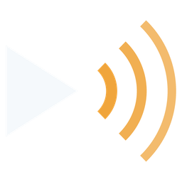
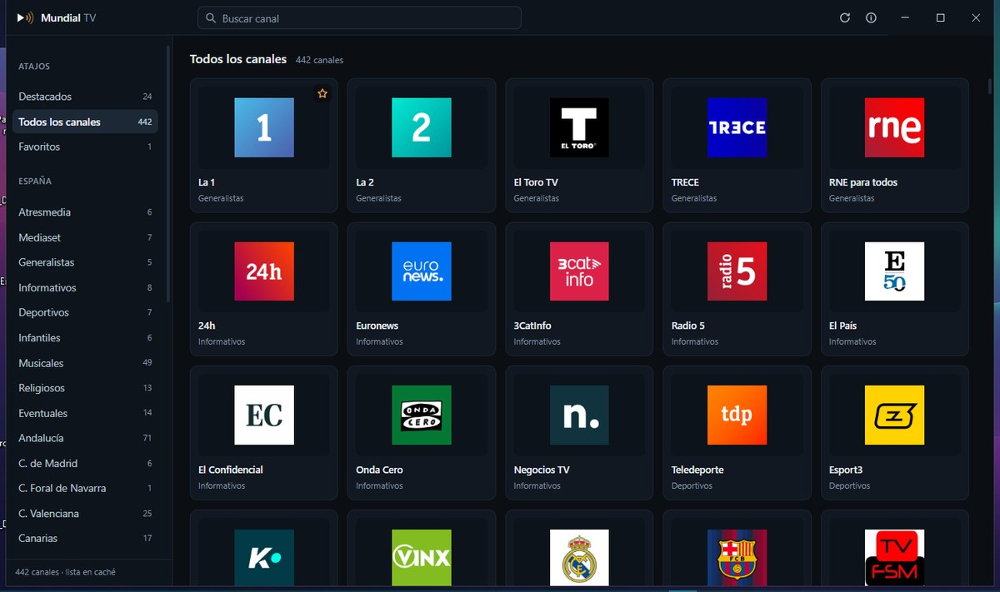
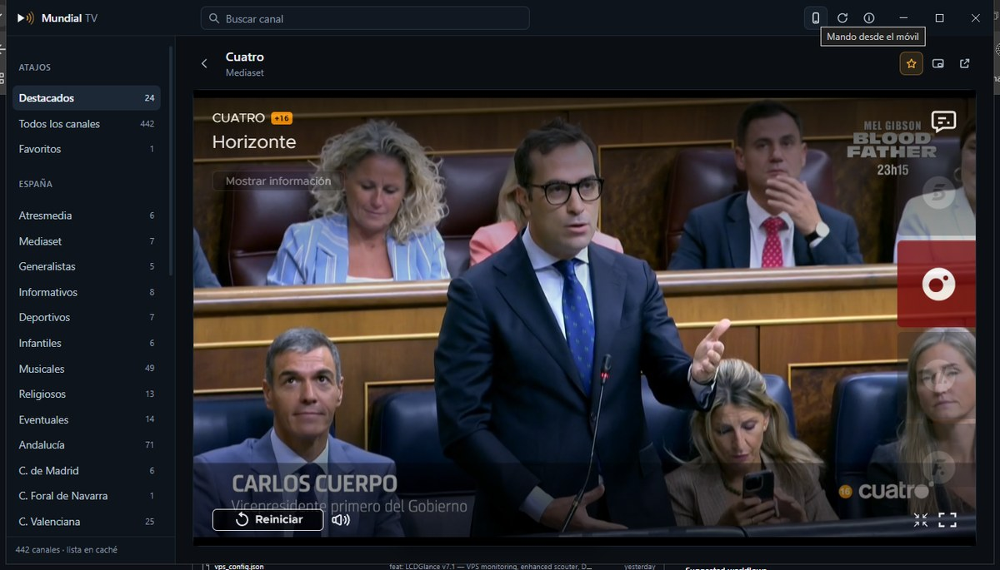
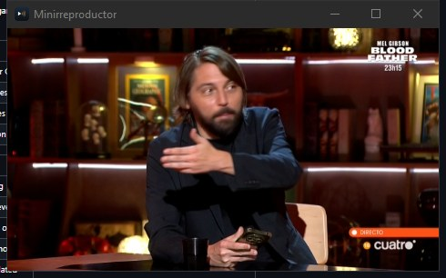
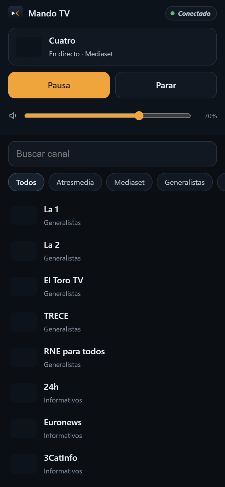

<div align="center">



# Mundial TV

**Televisión en directo de todo el mundo, en el escritorio.**

Rejilla de canales, reproductor propio con calidad y subtítulos, minirreproductor flotante y mando desde el móvil.

[](LICENSE)
[](#instalación)
[](https://www.electronjs.org)
[](#desarrollo)
[](https://github.com/smouj/mundial-tv/actions/workflows/build.yml)
[](https://github.com/smouj/mundial-tv/releases)



</div>

## Índice

- [Qué es](#qué-es)
- [Capturas](#capturas)
- [Canales](#canales)
- [Instalación](#instalación)
- [Uso](#uso)
- [Mando desde el móvil](#mando-desde-el-móvil)
- [Cómo funciona](#cómo-funciona)
- [Desarrollo](#desarrollo)
- [Estructura del proyecto](#estructura-del-proyecto)
- [Privacidad](#privacidad)
- [Aviso legal](#aviso-legal)
- [Créditos](#créditos)

---

## Qué es

Mundial TV es una aplicación de escritorio para ver televisión en directo desde el ordenador. Reúne los canales en una sola ventana —sin anuncios intermedios, sin registros y sin pasar por páginas web— y está pensada para que abrirla y poner un canal sea lo único que tengas que hacer.

- **Rejilla de canales** con sus logotipos reales, ordenada por género y por comunidad o país.
- **Reproductor propio** para los canales que emiten en HLS: calidad seleccionable, pista de audio —castellano, original, audiodescripción— y subtítulos.
- **Conmutación automática de fuente.** Casi todos los canales publican varias direcciones; si la primera falla, se prueban las siguientes sin que tengas que hacer nada.
- **El canal no se corta al elegir otro.** Al volver a la rejilla, lo que estabas viendo pasa a una ventana flotante y sigue en marcha hasta que escojas otro canal.
- **Minirreproductor siempre visible**, por encima del resto de ventanas, para seguir viéndolo mientras haces cualquier otra cosa.
- **Mando desde el móvil.** Un código QR abre en el teléfono una página para cambiar de canal, pausar y ajustar el volumen. Se puede añadir a su pantalla de inicio y queda como una aplicación con su propio icono.
- **Favoritos**, búsqueda instantánea y memoria del último canal visto.
- **Copia local de la lista**, para que la aplicación abra con contenido incluso sin conexión en ese momento.

## Capturas

| Reproductor | Minirreproductor | Mando del móvil |
| :---: | :---: | :---: |
|  |  |  |
| Calidad, audio y subtítulos, con los controles propios | El canal sigue viéndose por encima de todo | Cambia de canal desde cualquier teléfono |

## Canales

La televisión en directo no se emite de una única forma, y conviene decirlo claro:

| Grupo | Cómo se ve | Canales |
| --- | --- | --- |
| **Emisión HLS pública** | Reproductor propio, con calidad, audio y subtítulos | La 1, La 2, 24h, Teledeporte, Clan, TRECE, autonómicas, temáticos, locales y más de un centenar de internacionales |
| **Reproductor oficial** | Web oficial incrustada en la ventana | Antena 3, laSexta, Neox, Nova, Mega, Atreseries, Telecinco, Cuatro, FDF, Boing, Divinity, Energy, Be Mad |

Mediaset y Atresmedia no ofrecen su señal como HLS libre, así que no se recurre a ninguna fuente de terceros: se abre su propio reproductor, tal cual. Si un canal oficial no carga, siempre queda el botón para abrirlo en el navegador.

## Instalación

1. Descarga el instalador desde **[Releases](https://github.com/smouj/mundial-tv/releases)**.
2. Ejecútalo. Crea el acceso directo en el escritorio y en el menú Inicio, con el icono de la aplicación.

**Requisitos:** Windows 10 o Windows 11 de 64 bits.

## Uso

### Atajos de teclado

| Tecla | Acción |
| --- | --- |
| `/` | Ir al buscador |
| `Espacio` o `K` | Reproducir o pausar |
| `F` | Pantalla completa |
| `M` | Silenciar |
| `↑` `↓` | Subir o bajar el volumen |
| `R` | Abrir el mando del móvil |
| `Esc` | Salir del buscador |

### El minirreproductor

El botón situado junto a la estrella de favoritos deja el canal en una ventana pequeña que se mantiene por encima del resto. No se abre ninguna conexión nueva: es el mismo canal cambiando de ventana, así que no se corta ni consume el doble de datos.

## Mando desde el móvil

Pulsa el botón del teléfono, en la barra superior —o la tecla `R`— y aparece un **código QR**. Escanéalo con la cámara del móvil y tendrás el mando abierto.

- Sirve **cualquier teléfono**: es una página web normal, no hay que instalar nada.
- El teléfono tiene que estar en **la misma red Wi-Fi** que el ordenador.
- Desde esa página se cambia de canal, se pausa, se para y se regula el volumen. Mientras eliges, el ordenador cambia al instante.
- Se puede **añadir a la pantalla de inicio**: en Android, menú del navegador → *Añadir a pantalla de inicio*; en iPhone, *Compartir* → *Añadir a pantalla de inicio*. Queda con el icono de la aplicación y abre a pantalla completa.
- **La dirección no cambia entre arranques.** El móvil que ya la tenga guardada —o el icono de su pantalla de inicio— sigue funcionando sin volver a escanear nada. Si quieres cortarle el acceso a un teléfono, el botón **Clave nueva** invalida la dirección anterior y muestra otro código.

> **Si el móvil no conecta**, casi siempre es el cortafuegos de Windows: la primera vez que la aplicación abre el mando puede preguntar si permites el acceso, y hay que aceptar en redes privadas. Si no aparece el aviso, se puede autorizar a mano desde una consola **como administrador**:
>
> ```powershell
> netsh advfirewall firewall add rule name="Mundial TV - mando" dir=in action=allow protocol=TCP localport=8712
> ```

## Cómo funciona

1. Al arrancar, la aplicación lee la lista pública de canales del proyecto [TDTChannels](https://www.tdtchannels.com) y la guarda en caché durante seis horas.
2. Las entradas se agrupan por canal, se descartan las direcciones que necesitan parámetros imposibles de rellenar y se ordenan las fuentes dejando primero las que no tienen restricción geográfica.
3. Los canales con emisión directa se reproducen con [hls.js](https://github.com/video-dev/hls.js) sobre el motor de Chromium. Las cabeceras de las peticiones de vídeo se normalizan para que ningún servidor rechace la petición por venir de una aplicación de escritorio.
4. Los canales que solo emiten desde su web oficial se muestran en una vista incrustada de nivel superior, con su propia sesión y sus propias cookies. Esa misma vista se aparta mientras hay un cuadro de diálogo abierto, porque se dibuja siempre por encima de la página y si no lo taparía.
5. El salto de anuncios **no bloquea ni elimina publicidad**: únicamente busca el botón que la propia web ofrece —«Saltar anuncio», «Omitir», «Skip»— y lo pulsa en cuanto aparece.
6. El mando es un servidor web mínimo dentro del proceso principal. Solo escucha en la red local, exige la clave de la sesión y no expone nada más que la lista de canales y el estado de reproducción.

## Desarrollo

```bash
git clone https://github.com/smouj/mundial-tv.git
cd mundial-tv
npm install          # dependencias
npm run vendor       # copia hls.js dentro del código de la aplicación
npm start            # abre la aplicación
npm test             # pruebas
```

Otras órdenes:

| Orden | Para qué |
| --- | --- |
| `npm run snapshot` | Regenera la copia de la lista incluida en la aplicación |
| `npm run icons` | Regenera los iconos y el símbolo de la interfaz |
| `npm run dist` | Genera el instalador de Windows en `dist/` |
| `npm run dist:dir` | Genera la aplicación sin instalador, para probarla |

Las pruebas cubren el analizador de listas M3U y el servidor del mando, y se ejecutan sin necesidad de abrir la aplicación.

## Estructura del proyecto

```
src/
  main/                   proceso principal de Electron
    main.js               ventana, caché de la lista, minirreproductor, salto de anuncios
    playlist.js           lectura y normalización de listas M3U/EXTINF (sin dependencias)
    remote.js             servidor del mando: estado, órdenes y manifiesto
    remote-page.js        página del mando que se sirve al teléfono
    official-channels.js  canales que solo emiten desde su reproductor oficial
    settings.js           preferencias en disco
  preload/                puente aislado entre la interfaz y el proceso principal
  renderer/               interfaz: rejilla, búsqueda, favoritos y reproductor
    vendor/               hls.js empaquetado, sin depender de ninguna CDN
  assets/                 símbolo de la aplicación
scripts/                  iconos, copia de hls.js y copia de la lista
test/                     pruebas del analizador y del mando
build/                    recursos de compilación
docs/                     capturas para esta documentación
```

## Privacidad

Sin cuentas, sin telemetría y sin servidores propios. La aplicación solo se conecta a la lista pública de canales, a los servidores de vídeo de las cadenas, a los logotipos y a los reproductores oficiales. Las preferencias se guardan en tu equipo, en `%APPDATA%\Mundial TV`.

El mando escucha únicamente en la red local, está protegido por una clave que no se envía a ninguna parte y no sale a internet.

## Aviso legal

Este programa no emite, aloja ni retransmite contenido alguno: es un reproductor. Las direcciones de los canales proceden de la lista pública del proyecto [TDTChannels](https://github.com/LaQuay/TDTChannels), publicado bajo licencia Apache-2.0, y los canales de Mediaset y Atresmedia se ven desde sus reproductores oficiales. El salto automático de anuncios no bloquea ni elimina publicidad. Los derechos de las emisiones y de las marcas pertenecen a sus titulares.

## Créditos

- [TDTChannels](https://www.tdtchannels.com), de LaQuay, por la lista pública de canales.
- [hls.js](https://github.com/video-dev/hls.js), por el motor de reproducción en el navegador.
- [Electron](https://www.electronjs.org) y [Chromium](https://www.chromium.org), por la base sobre la que se ejecuta.

## Licencia

[MIT](LICENSE) © 2026 SMOUJ013
